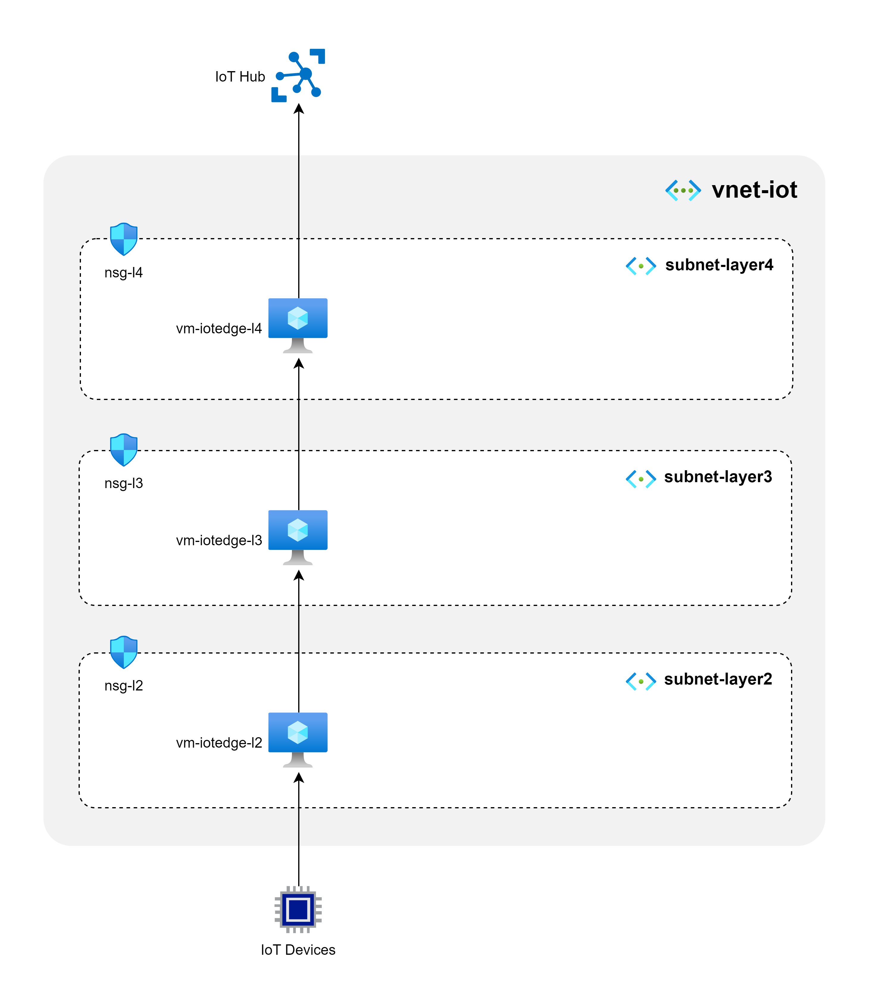

# Nested IoT with Storage

References:
- https://github.com/azugfr/RedShirtTour-IoT-Edge-AI-Lab


## Lab Setup

Our lab consits of 3 layers, from Layer 2 to Layer 4. Each layer has a single IoT Edge device, and each device is connected to the next layer. The devices are connected to the cloud through the IoT Hub.



### Step 1. Create Lab infra

Create one Virtual network with 3 subnets, one for each layer. Create a VM in each subnet and install IoT Edge runtime on each VM.

We are using the templates provided in the [documentation](https://github.com/Azure/iotedge-vm-deploy).

```bash
cd iot-edge-lab-deploy

# Create resource group
az group create --name nested-iot --location westus

# Create lab infra
az deployment group create \
  --resource-group nested-iot \
  --template-file ./main.bicep \
  --parameters prefix='lab2' \
  --parameters adminUsername='azureuser' \
  --parameters adminPasswordOrKey="$(< ~/.ssh/id_rsa.pub)"
```

### Step 2. Generate certificates

Following the [documentation](https://learn.microsoft.com/en-us/azure/iot-edge/how-to-connect-downstream-iot-edge-device?view=iotedge-1.5&tabs=azure-cli#generate-certificates), we need to generate the following certificates:

- A root CA certificate, which is the topmost shared certificate for all the devices in a given gateway hierarchy. This certificate is installed on all devices.
- Any intermediate certificates that you want to include in the root certificate chain.
- A device CA certificate and its private key, generated by the root and intermediate certificates. You need one unique device CA certificate for each IoT Edge device in the gateway hierarchy.

```bash
cd ca-certificates

# Create the the root CA test certificate
./certgen.sh create_root_and_intermediate

# Create the layer 4 parent (gateway) device test certificate 
# signed by the shared root CA certificate
./certgen.sh create_edge_device_ca_certificate "layer4"

# Create the layer 3 child (gateway) device test certificate 
# signed by the shared root CA certificate
./certgen.sh create_edge_device_ca_certificate "layer3"

# Create the layer 2 downstream device test certificate
# signed by the shared root CA certificate
./certgen.sh create_edge_device_ca_certificate "layer2"
```

Copy certificates and keys for each device to the corresponding device folder. Use /var/aziot/certs for certificates and /var/aziot/secrets for keys.

### Step 3. Configure Layer 4 device

Transfer the prep shell script file, the root CA certificate, parent device CA certificate, and parent private key to the parent device:
- `prep-device.sh`
- `azure-iot-test-only.root.ca.cert.pem`
- `iot-edge-device-ca-layer4-full-chain.cert.pem`
- `iot-edge-device-ca-layer4.key.pem`

In the device shell where the above files where copied to, run the following commands:

```bash
chmod +x prep-device.sh
./prep-device.sh layer4
```


######

openssl x509 -noout -subject -in ./iot-edge-device-ca-layer2.cert.pem